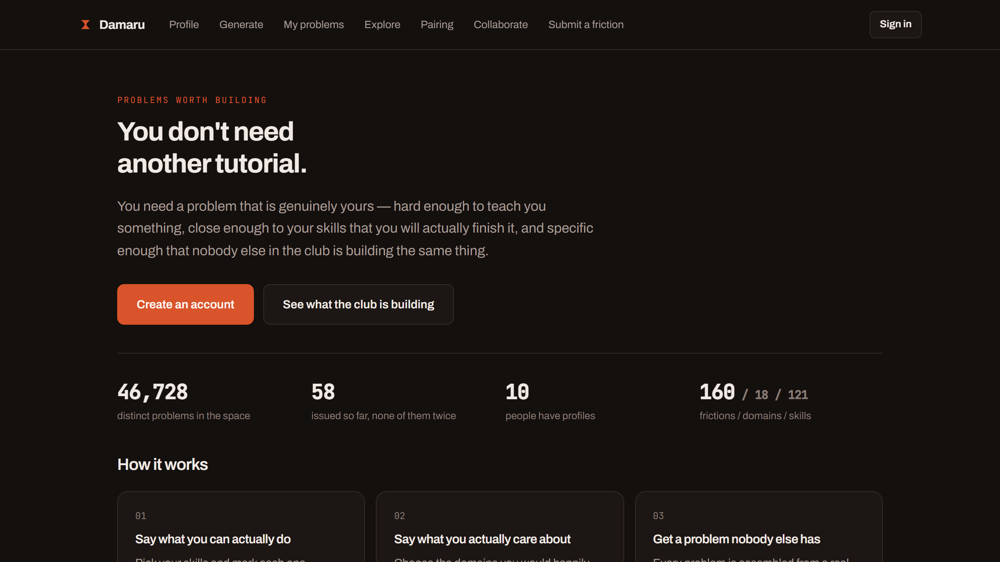
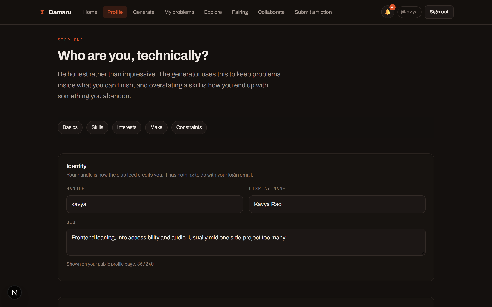
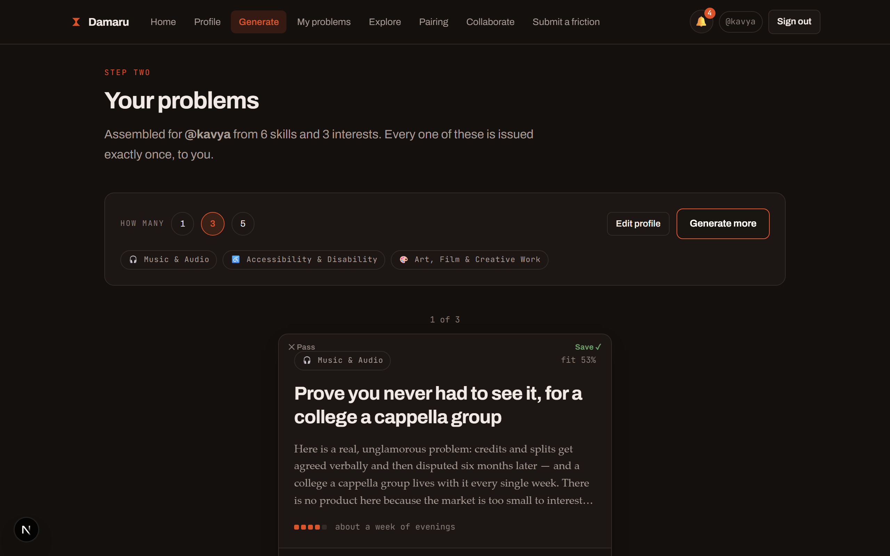
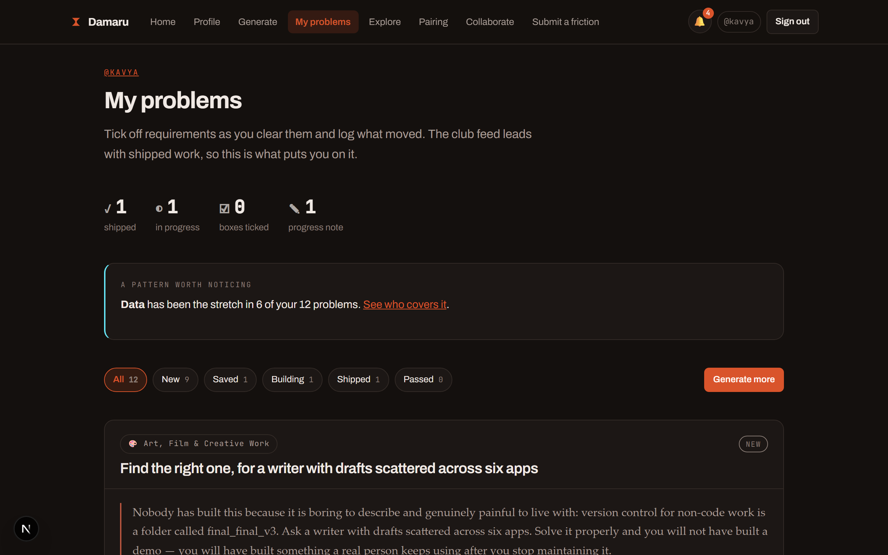
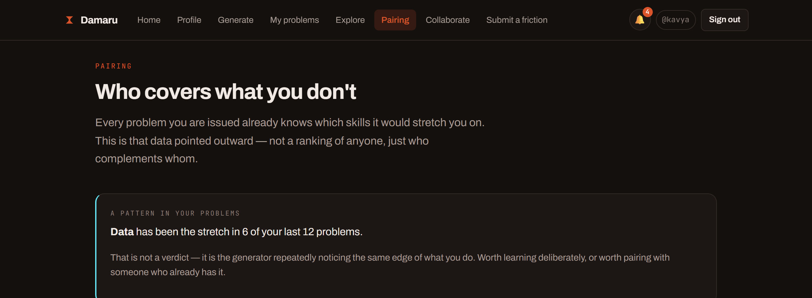
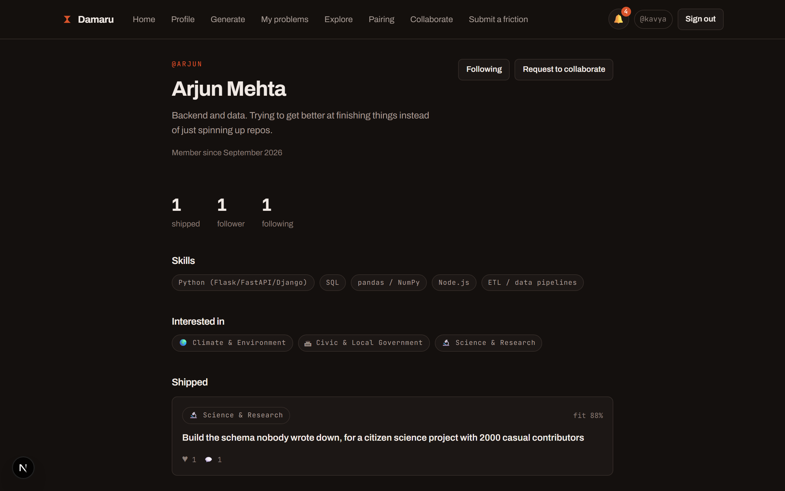
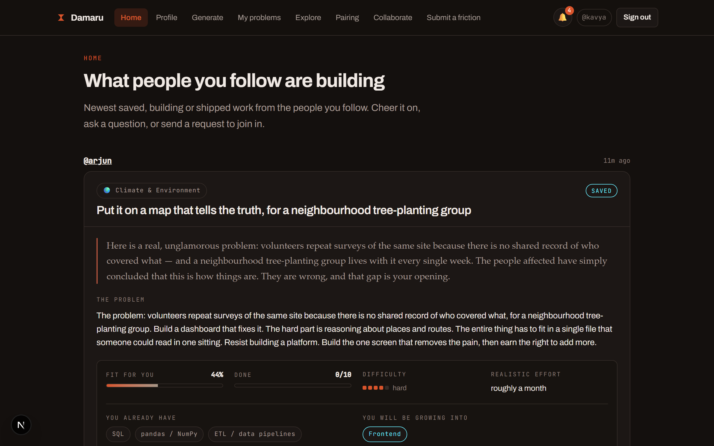
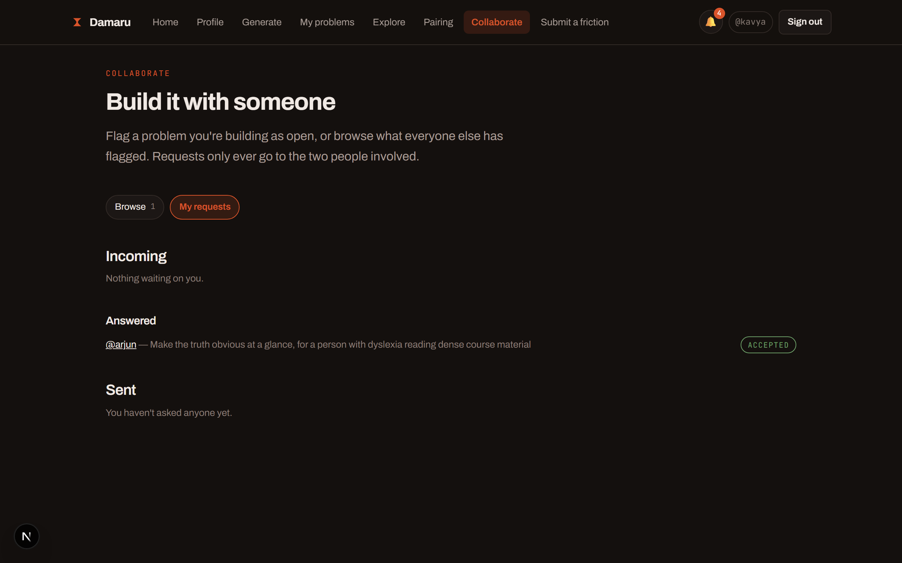
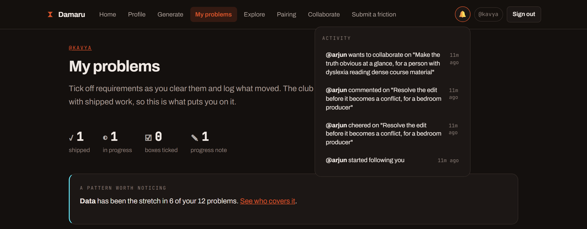

# Damaru

A website where people upload their skills and interests, and get back a project
problem statement that is **specific to them**, **doable with what they know**, and
**never issued to anyone else** — then a small social layer around it: follow people,
see what they're building in a home feed, cheer it on or comment, and ask to join in.

Next.js + TypeScript, Supabase (Postgres + auth), deployable to Vercel for free.

---

## What it looks like

The pitch, then the actual product.



Honest self-assessment first — skills marked by how comfortable you actually are, not
a wishlist:



A batch to triage, one card at a time — not a wall of text to read before deciding
anything:



Then it's yours to track: tick off requirements, log what moved, flag it as open for
someone else to join:



---

## Quick start

**1. Create a Supabase project.** [supabase.com](https://supabase.com) → New project →
wait ~2 min for it to provision.

**2. Run the schema.** In the project, left sidebar → **SQL Editor** → **New query** →
paste the entire contents of [`supabase/schema.sql`](supabase/schema.sql) → **Run**.
Then run [`supabase/migrations/002b_seed_frictions.sql`](supabase/migrations/002b_seed_frictions.sql)
the same way, which loads the 144 starting frictions into the catalogue.

An existing project instead runs the numbered files in `supabase/migrations/` in
order, once each.

**3. Get your credentials.** **Project Settings → API**. Copy the **Project URL**, the
**anon / public** key, and the **service_role** key (click reveal).

**4. Configure the app.**

```bash
cp .env.local.example .env.local
```

Fill in the three values from step 3. `.env.local` is gitignored — it never leaves
your machine.

**5. Install and run.**

```bash
npm install
npm run dev
```

Open http://localhost:3000. Sign up, confirm the account (see [Email
confirmation](#email-confirmation) below), build a profile, generate.

Requires **Node 22.5+** (24 recommended).

---

## What it costs to run

Nothing, at club scale. There is no LLM API key — the generator is a local
combinatorial engine. Supabase's free tier (500 MB database, 50k monthly active
users, unlimited API requests) covers this comfortably; Vercel's free tier covers
the hosting. You will not hit either ceiling running this for a club.

---

## How the generator works

Most "project idea generators" stop at a noun: *build an app for music*. That
produces ideas nobody finishes, because there is no user, no crux, and no
constraint. Damaru assembles every problem from six bound parts:

| Part | What it contributes | Lives in |
|---|---|---|
| **Domain** | The area the person cares about | `catalog/domains.ts` |
| **Actor** | A specific kind of person who feels the pain | bound to each friction |
| **Friction** | A concrete, unglamorous, recurring annoyance | the `frictions` table |
| **Mechanic** | The technical crux — what's actually interesting to build | `catalog/blocks.ts` |
| **Artifact** | The shipping format: web app, CLI, bot, device, investigation | `catalog/blocks.ts` |
| **Twist** | A constraint that forces it somewhere non-obvious | `catalog/blocks.ts` |

Frictions live in Postgres; domains, mechanics, artifacts and twists stay in
code. That split is deliberate: the structural pieces change rarely, but
frictions are the thing club members write, and an accepted submission reaches
the generator immediately with no deploy. The engine itself stays a pure,
synchronous function — the catalogue is passed in by the route that loads it,
not fetched from inside `generateProblems()`.

**The parts are bound, not sampled independently.** Each friction names the actor
who feels it and the mechanics that could plausibly answer it; each mechanic names
the artifact shapes it can sensibly ship as. Sampling those freely is how a
generator ends up proposing a playable game to fix a timetable clash — coherent
grammar, nonsense content. The bindings are the difference.

The landing page counts the valid space from the live catalogue
(`combinationSpace()`), so the figure moves the moment a friction is accepted —
it starts at 40,992 with the 144 seeded frictions, and every new one adds
roughly two hundred.

### Doability

Skills collapse into per-category strengths (`engine/fit.ts`). Each candidate is
scored on how much of what it needs the person already has:

- **≥ 0.75** in a category → *covered*
- **> 0** but below that → *stretch*
- **0** → *gap*

A candidate is rejected below **0.34 fit** or with **more than one gap** — below
that line you spend the whole project fighting tools rather than the problem.
Everything surviving is ranked by distance from the person's stated appetite:

| Appetite | Target fit |
|---|---|
| Play to my strengths | 0.86 |
| Stretch me | 0.68 |
| Throw me in | 0.52 |

Difficulty and the effort estimate are computed **relative to this person**, not in
the abstract — the same problem is a weekend for one profile and a term for another.

### When nothing clears the bar

A narrow profile can have an *empty* intersection between "mechanics these
frictions allow" and "mechanics this person can build" — four hardware skills
against two software-shaped interests, for instance. Returning nothing there is
the wrong answer, so `RELAXATIONS` in `engine/index.ts` lowers the bar a step at a
time and says so on the card:

| Tier | Bar | Domains | Card shows |
|---|---|---|---|
| 1 | fit ≥ 0.34, ≤ 1 gap | chosen only | nothing — normal result |
| 2 | fit ≥ 0.24, ≤ 2 gaps | chosen only | "bigger stretch than you asked for" |
| 3 | fit ≥ 0.34, ≤ 1 gap | all | "outside the interests you picked" |
| 4 | fit ≥ 0.12, ≤ 3 gaps | all | "well outside both" |

It stops at the strictest tier that fills the request, so a well-matched profile
never sees a caveat. An empty page is now only possible when every combination
that fits has already been issued — which the error message says explicitly.

### Uniqueness

Every problem's DNA hashes to a 64-bit `fingerprint`, which is `UNIQUE` in
Postgres. Generation excludes every fingerprint ever issued to anyone, and the
unique constraint is the final arbiter if two requests race. No two people in the
club can ever be handed the same problem.

---

## Auth and data access

Identity is Supabase Auth (email + password) — `profiles.id` **is** the
`auth.users.id`, so a profile can only ever belong to the account that owns it.
`handle` is a separate, user-chosen public display name shown on the club feed; it
has nothing to do with login and carries no authorization weight.

The server is the trusted gatekeeper, the same architecture as before the
migration: every route that touches data calls `getCurrentUser()` and checks
ownership itself (`src/lib/db.ts` talks to Postgres through the **service-role**
key, which bypasses Row Level Security entirely). RLS policies in
`supabase/schema.sql` exist as defense in depth — if the anon key ever reached
Postgres directly, they are what stop it reading or writing someone else's data —
not as the primary enforcement.

**The one thing genuinely worth knowing:** `PATCH /api/problems/[id]` didn't check
ownership at all in the pre-Supabase version — anyone who knew or guessed a
problem's UUID could edit its status and notes. That's fixed as part of this
migration (`src/app/api/problems/[id]/route.ts` now checks `problem.profileId ===
user.id`), but call it out if you're diffing.

### Email confirmation

Supabase requires a clicked confirmation link before a new account gets a session,
by default. The signup flow handles this (`src/app/auth/actions.ts` checks whether
`signUp` returned a session and redirects to a "check your email" notice if not),
but for a club tool the friction may not be worth it. To turn it off: **Authentication
→ Providers → Email → uncheck "Confirm email"**. Either way works with no code
change.

---

## Pairing

Every problem the generator issues already knows which skill categories it would
stretch the person on — `fit.ts` computes it to render one chip and then throws
it away. `/pair` points that data outward: who covers what you don't, and what
you cover for them.



Two rules the implementation holds to, because this is the feature that can land
badly socially:

- **Complement, never ranking.** `findComplements()` has no notion of a stronger
  or weaker member and produces no score you could sort people by. The unit is
  always a pair, and mutual pairs sort above one-way ones — which are labelled
  as favours rather than quietly mixed in.
- **Being listed is the person's own call.** `profiles.discoverable` defaults on
  but is toggleable from the profile page or `/pair`. Only a handle and skill
  categories are ever exposed; profiles hold no email.

The dashboard also surfaces a recurring-gap note ("design has been the stretch in
4 of your 6 problems"). It is drawn from problems already issued, and stays
silent until a category has appeared more than once.

The same page also has a **"Browse by expertise"** directory — every discoverable
member, filterable by skill category, each with an inline "request to collaborate"
composer. This is where a *general* collaboration request (not tied to any specific
problem) comes from; see the next section.

---

## Follow, a home feed, and collaborating

The pieces above (profiles, pairing, problems) exist independently of each other by
design — but the club is made of people, not just a catalogue, so there is a thin
social layer stitched across all of it: follow people, get a feed of what they're
building, react to it, and ask to join in.

### Public profiles, following, likes and comments

Every member has a public page at `/u/[handle]` — bio, skills, interests, and their
**shipped** work, each with like and comment counts. Following someone is one button;
follower/following counts are public the same way the club feed already is.



A problem is treated like a post: anyone signed in can like it (♥) or leave a
comment, from the dashboard, the feed, or Explore. `Engagement.tsx` is the one
component that owns this everywhere it appears — optimistic like toggling, lazy-loaded
comment thread, nothing else needs to know how either works.

### The home feed

`/home` is the default landing page after signing in: the newest saved, building or
shipped problems from people you follow, newest first, each with its engagement bar
attached. An account that follows nobody gets pointed at Explore and the pairing
directory instead of an empty page.



### Collaboration requests

Two ways to end up building something with someone else, sharing one
`collab_requests` table (a nullable `problem_id` is the only difference):

- **Flag a specific problem.** From the dashboard, mark a `saved` or `building`
  problem "open to collaborators." It shows up on `/collaborate`'s Browse tab for
  everyone else, next to what skill categories it could use a hand with (the same
  `fit.gaps`/`fit.stretch` data the problem already carries).
- **A general request.** Found someone through the pairing directory or their
  profile page whose skills you want, but not around a specific problem? Send them
  a request directly.

Either way, the request goes to exactly one person, who accepts or declines from
`/collaborate`'s "My requests" tab — never a public thread, never CC'd to anyone
else.



### Notifications

A bell in the nav with an unread badge: new follower, someone liked or commented on
your problem, a collaboration request came in or got accepted. It polls quietly every
45 seconds and marks everything read the moment the dropdown opens.



---

## Contributing frictions

The catalogue is the quality lever. Every friction that shipped originally was
written by one person guessing at what annoys people; the ones worth building
against are the ones somebody has actually lived with.

- **`/submit`** — any signed-in member proposes one: a domain, who feels it, what
  is broken, and which mechanics could plausibly answer it. The form teaches the
  bar inline, because a vague friction is worse than none.
- **`/admin/frictions`** — the review queue. Accepting puts it in the generator
  immediately.

Admin is set in the database and nowhere else:

```sql
update profiles set is_admin = true where handle = 'your-handle';
```

`is_admin` is deliberately absent from the profile upsert's column list, so it
survives profile edits and cannot be granted through the API.

---

## Triage and feedback

A freshly generated batch is 3-5 problems, each several screens long once
expanded. Reading all of them in full before deciding on any is the wrong
default, so `/generate` hands a batch to `<SwipeTriage>` instead of a flat list:
a compact card (title, hook, fit%), decided by drag, tap, or the arrow keys,
with an explicit "read the full brief" escape hatch before committing — nobody
should be swiping blind on something they might spend weeks building.

Swiping does not invent new state. It writes the same `saved` / `passed`
statuses the dashboard already understands, just with a faster gesture for the
one moment - right after generation - where that's the only decision that
matters.

Each `ProblemCard` also carries a 👍/👎: not a rating of the person, a signal on
whether *this friction* actually produced a good problem for them. That only
means something once it can be traced back to where it came from, so
`ProblemDNA.frictionId` links every problem to the specific catalogue row it
was drawn from - added at generation time in `engine/index.ts`, not
reconstructed later by matching text. `/admin/frictions` rolls the tally up
per friction on the accepted tab, so a friction that is quietly producing bad
matches is visible rather than assumed.

---

## Deploying to Vercel

1. Push this repo to GitHub (already done if you're reading this from the repo).
2. [vercel.com](https://vercel.com) → **New Project** → import the repo.
3. Add the same three environment variables from `.env.local` in the Vercel
   project's **Settings → Environment Variables**.
4. Deploy.

No other configuration needed — Vercel detects Next.js automatically, and there is
no filesystem dependency left (that was the whole reason for this migration: the
SQLite version could not run on Vercel's read-only, ephemeral filesystem at all).

---

## Project structure

```
supabase/
  schema.sql             tables, constraints, RLS policies - run once per project
  migrations/            numbered deltas for a project that already has the schema
docs/
  screenshots/            images used in this README
src/
  middleware.ts           refreshes the Supabase session cookie on every request
  app/
    page.tsx               landing
    login/, signup/         auth pages
    auth/actions.ts         server actions: login, signup, logout
    (app)/                  auth-gated route group
      layout.tsx             redirects to /login if no session
      home/                    following-based feed - the default landing page signed in
      profile/                skills, interests, constraints
      generate/                draw new problems
      dashboard/               your problems + status + notes
      pair/                     who complements you + browse by expertise
      collaborate/              browse problems open to collaborators + your requests
      submit/                    propose a friction
      admin/frictions/            review queue (is_admin only)
    browse/                 public "Explore" club feed (no auth required)
    u/[handle]/             public profile page - follow, shipped work, request to collaborate
    api/
      me/                    GET current session's user + profile
      profile/               GET / POST (session-scoped)
      generate/               POST { count } (session-scoped)
      home/                    GET following-based feed, with engagement attached
      problems/                GET (your problems, session-scoped)
      problems/[id]/            PATCH { status, notes, checklist, feedback, lookingForCollaborators } - ownership-checked
      problems/[id]/progress/    POST one "what moved" line
      problems/[id]/like/         POST toggle a like
      problems/[id]/comments/     GET / POST comments (GET is public)
      problems/[id]/collab-requests/  POST request to join a flagged-open problem
      profiles/[handle]/         GET public profile bundle (shipped work, follower counts)
      profiles/[handle]/follow/   POST / DELETE
      profiles/[handle]/collab-requests/  POST a general (non-problem) request
      collab-requests/            GET incoming + outgoing, split by direction
      collab-requests/[id]/        PATCH { status: accepted | declined } - recipient-only
      collaborate/               GET problems flagged open to collaborators
      directory/                 GET discoverable members, filterable by strong category
      notifications/              GET recent + unread count
      notifications/read/          POST mark everything read
      frictions/                GET/POST your own submissions
      admin/frictions/           GET review queue + feedback tally (is_admin only)
      admin/frictions/[id]/       PATCH accept/reject
      pair/                    GET complements + recurring gap
      stats/                  GET counts
  components/
    Nav.tsx                  top nav + auth state + notification bell
    ProblemCard.tsx           the full problem view - checklist, progress log, engagement bar
    Engagement.tsx             the like button + comment thread, shared by every problem view
    NotificationBell.tsx        unread badge + dropdown, polls every 45s
    SwipeTriage.tsx          drag/tap/arrow-key triage for a freshly generated batch
    DamaruSpinner.tsx         the loading indicator - an actual damaru being played
    Mark.tsx                 the wordmark, reused as the spinner's body
  lib/
    types.ts                shared domain types
    db.ts                   Postgres data access via the service-role client
    activity.ts              staleness + checklist progress (shared client/server)
    pairing.ts                complement + recurring-gap logic
    client.ts                 tiny fetch wrapper client components use to call the API
    supabase/
      server.ts               session-aware client (reads cookies, respects RLS)
      admin.ts                 service-role client (bypasses RLS - server only)
      browser.ts                browser client
      types.ts                  hand-written Database type for supabase-js
    catalog/
      skills.ts               121 skills across 19 categories (11 software, 8 non-software engineering)
      domains.ts               18 domains (frictions live in Postgres)
      blocks.ts                 30 mechanics, 14 artifacts, 18 twists
    engine/
      index.ts                candidate selection  <- the LLM seam
      fit.ts                   doability scoring
      compose.ts                 prose composition, incl. 5 title variants per mechanic
      novelty.ts                  fingerprinting + seeded RNG
```

---

## Extending it

Nearly all the quality lives in the catalogue, not the code.

**Add a friction** — use `/submit` in the app. They live in the database now, so
no code change or deploy is involved.

**Add a domain** — append to `DOMAINS` in `catalog/domains.ts` (id, label, icon,
signals). Frictions then get attached to it through `/submit`.

**Add a mechanic** — append to `MECHANICS` in `catalog/blocks.ts`, list the
`artifacts` it can ship as, the skill categories it `requires`, and add a handful of
short imperative variants to `MECHANIC_ACTIONS` in `engine/compose.ts` (one is picked
per problem, seeded from its fingerprint, and becomes the title).

**Add a twist** — append to `TWISTS`. This is the cheapest way to multiply the
space: each new twist multiplies every existing combination.

Writing frictions is the real work. The test is whether a specific person would
read it and wince. "Data is siloed" fails. "Their sample library is four thousand
unlabelled WAV files and finding the right kick means auditioning for an hour"
passes.

### Swapping in an LLM later

`generateProblems()` in `src/lib/engine/index.ts` is the only seam. Everything
downstream consumes `GeneratedProblem[]`, so a model-backed implementation is a
one-file change — keep `fit.ts` for scoring and `novelty.ts` for the uniqueness
guarantee, and let the model do composition. Not needed today; the offline engine
is the product.

---

## Known limitations

**The service-role key is powerful.** It bypasses every RLS policy in the
database. It lives only in `.env.local` (local) and Vercel's environment variable
store (production) via `server-only`-guarded modules — never commit it, never put
it in a client component, never paste it anywhere but an env var.

**Rejecting a submission is silent.** The submitter sees the state change on
`/submit`, but nothing tells them why. For a club where you can just talk to the
person, that is probably right; it would not be on a larger tool.

**Changing the schema means updating two places.** `supabase/schema.sql` (the
actual database) and `src/lib/supabase/types.ts` (the hand-written TypeScript
`Database` type supabase-js needs to type-check inserts and updates) have to stay
in sync manually — there is no code generation step wired up.

**Notifications poll, they don't push.** `NotificationBell` checks every 45 seconds
and on mount - simple, and fine at club scale, but a new follower or comment can take
up to that long to show up in the badge without a page reload. No websocket or
Supabase Realtime subscription wired up for it.
